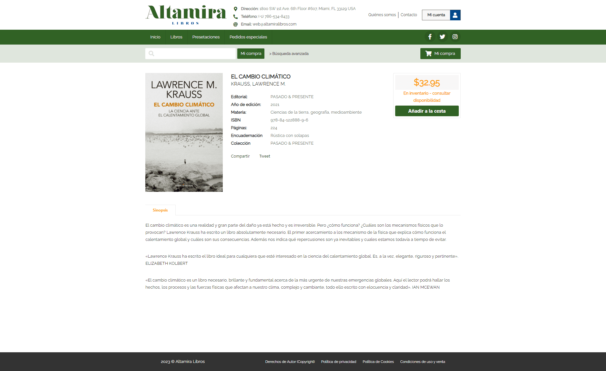

# Landing Newhorizon

Landing hecho en WordPress

**DEMO** &#x279c; [https://newhorizon-demo.netlify.app](https://newhorizon-demo.netlify.app)

## Preparar Entorno

- Instalar LAMP (Apache, MySql, PHP) en el entorno del servidor.

  1. En Windows puede instalar [XAMPP](https://www.apachefriends.org/es/index.html)
  2. En Linux puede seguir esta guía:
     [Instalar LAMP en entorno Linux](https://gist.github.com/EdixonAlberto/0c95d228896c1893cfbcd6d237475aaf)

- Clonar este repositorio en la ruta [C:/xampp/htdocs](C:\xampp\htdocs) (Windows) o [/var/www/html](/var/www/html)
  (Linux)

- Crear desde apache un virtual host en la ruta `${SERVER_ROOT}/newhorizon`.

- Modificar el host del servidor para agregar el nuevo dominio `newhorizon.art`.

```sh
127.0.0.1     newhorizon.art
```

- Iniciar `phpMyAdmin` para restaurar la base de datos importando el siguiente archivo
  [newhorizon_db.sql](./docs/newhorizon_db.sql)

- Ingresar desde el navegador a la ruta [http://newhorizon.art/wp-admin](http://newhorizon.art/wp-admin) para iniciar
  sesión en el CMS con las siguientes credenciales:

```sh
# Usuario:    admin
# Contraseña: Pe3Kg0&)r(Qjjz^JZk
```

## Editar vistas estáticas (Desarrollo)

Usar Plugin Elementor.

- Ir a la sección `Páginas` y seleccionar "Editar con Elementor" para editar el "landing".
- Ir a la sección `Apariencia` y seleccionar "Elementor Header & Footer Builder" para editar el "header" y "footer".
- Ir a la sección `Contact` para editar los "forms" o formularios.
- Ir a la sección `Plantillas` para editar el "Sidebar" o panel lateral.

## Editar vistas dinámicas (Desarrollo)

Usar Editor de Código.

En la carpeta ubicada en [./wp-content/uploads/components/](./wp-content/uploads/components/) se encuentran todos los
componentes web creados con React con sus respectivos archivos CSS.

## Base de datos

Toda la información mostrada de los libros se encuentra en el siguiente archivo
[./wp-content/uploads/database/books.json](./wp-content/uploads/database/books.json)

## Visualización

- Página Home


- Página Books


- Página Book


